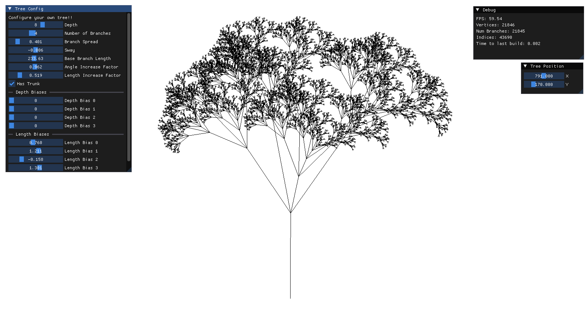
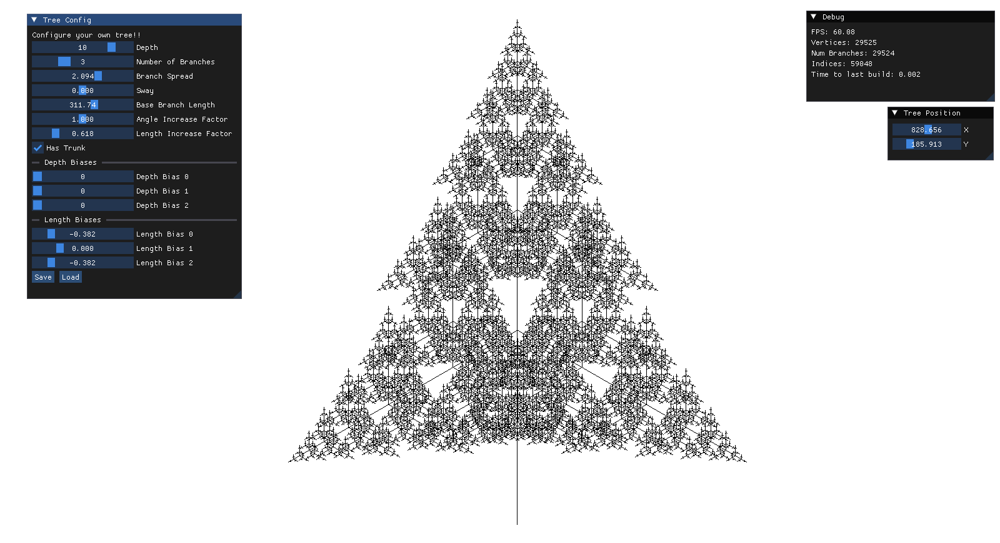
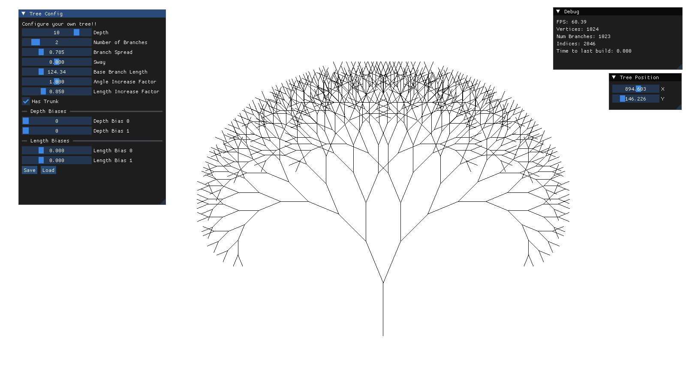

# Fractal Tree Creator

An app using OpenGL that lets you configure your own 2D fractal tree.

## Screenshots

## Installation

Download the [Latest Release](https://github.com/Ev01/FractalTree/releases).
Fractal Tree Creator requires your system to support at least OpenGL 3.3.

## Features / Controls

- Saving and loading tree configurations.
- Middle click and drag to pan.
- Scroll to zoom
